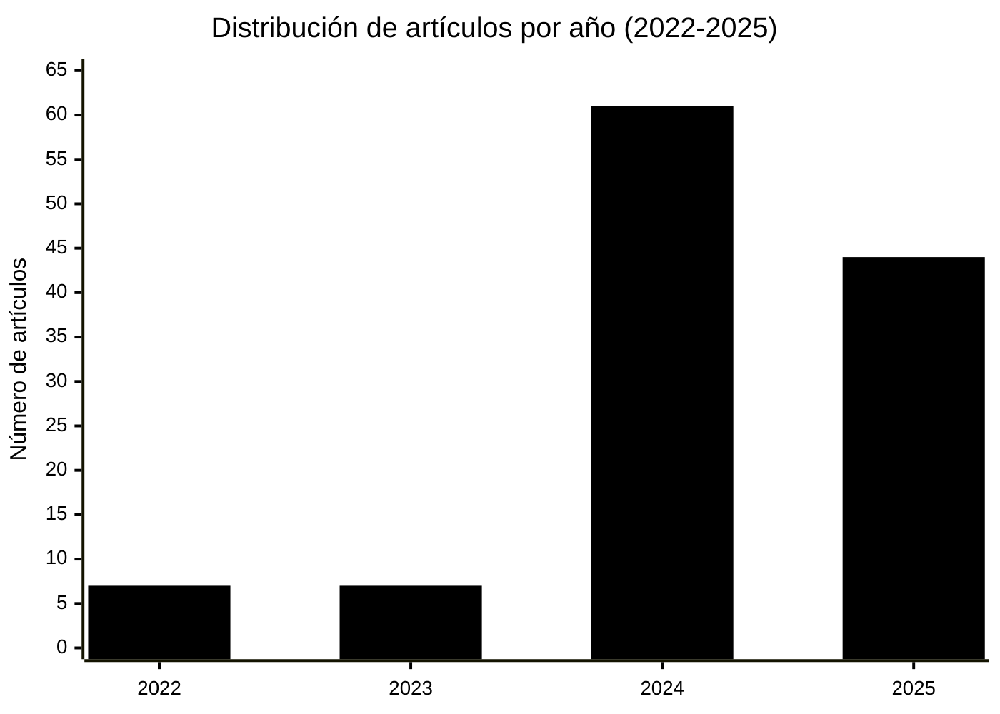

# Estado del arte. La personalidad sintética: evaluación psicológica de modelos de lenguaje (LLMs)

## Descripción

Este repositorio contiene una revisión sistemática de la literatura académica sobre la evaluación psicológica y manifestación de rasgos de personalidad en modelos de lenguaje grandes (LLMs, por sus siglas en inglés). La compilación abarca 119 artículos científicos publicados entre 2022 y 2025, proporcionando un análisis exhaustivo del estado actual de la investigación en este campo emergente.

## Contenido

El documento principal [`state-of-the-art-synthetic-personality-llms.md`](state-of-the-art-synthetic-personality-llms.md) incluye una tabla completa con la siguiente información para cada artículo:

- Número de referencia
- Título en inglés
- Título en español
- Resumen (abstract) en inglés
- Resumen en español
- URL del artículo original
- Idioma de publicación
- Año de publicación
- Autores
- Palabras clave

## Áreas temáticas

La revisión bibliográfica cubre las siguientes áreas de investigación:

### Evaluación psicométrica
- Aplicación de marcos teóricos clásicos (Big Five, MBTI, HEXACO, Myers-Briggs)
- Validación de instrumentos psicométricos para LLMs
- Confiabilidad y estabilidad de mediciones de personalidad
- Desarrollo de nuevas herramientas de evaluación específicas para IA

### Simulación y control de personalidad
- Métodos de inducción de rasgos de personalidad mediante prompts
- Técnicas de entrenamiento para alineación con perfiles específicos
- Consistencia de personalidad en múltiples contextos
- Personalización de agentes conversacionales

### Aplicaciones prácticas
- Agentes virtuales y sistemas de recomendación
- Evaluación psiquiátrica automatizada
- Simulación de comportamiento humano
- Interacción humano-computadora

### Consideraciones metodológicas y críticas
- Limitaciones de tests de autoevaluación en LLMs
- Disociación entre autoreportes y comportamiento
- Sesgos y aspectos éticos
- Validez de constructo en evaluación de IA

## Metodología

La selección de artículos se realizó mediante búsqueda sistemática en las siguientes fuentes:

- ArXiv (preprints)
- ACL Anthology
- Conferencias principales: NeurIPS, EMNLP, ACL, NAACL, EACL, COLING
- Revistas científicas: Nature, PNAS Nexus, JMIR, Computational Linguistics
- Bases de datos: PubMed Central, ResearchGate

Se priorizaron artículos que abordan directamente la evaluación, medición, inducción o manifestación de rasgos de personalidad en modelos de lenguaje grandes, con énfasis en estudios empíricos y marcos metodológicos rigurosos.

## Estadísticas

- Total de artículos: 119
- Rango temporal: 2022-2025
- Idioma de publicación: inglés (100%)
- Artículos con texto completo disponible: 119 (100%)

## Distribución temporal

- 2022: 7 artículos
- 2023: 7 artículos
- 2024: 61 artículos
- 2025: 44 artículos

## Uso y citación

Este recurso está disponible para la comunidad académica. Si utiliza esta compilación en su investigación, se agradece la citación apropiada del repositorio.

## Índice de referencias (APA)

A continuación se presenta el índice alfabético de las 119 referencias incluidas en la revisión bibliográfica, formateadas según la 7ª edición de las normas APA. Cada referencia incluye un enlace directo al artículo correspondiente en la tabla completa.

- [Abdulhai, M., Serapio-Garcia, G., Crepy, C., Valter, D., Canny, J., & Jaques, N. (2023). Moral Foundations of Large Language Models. https://arxiv.org/abs/2310.15337](state-of-the-art-synthetic-personality-llms.md#user-content-37)

- [Allbert, R., Wiles, J. K., & Grankovsky, V. (2024). Identifying and Manipulating Personality Traits in LLMs Through Activation Engineering. https://arxiv.org/abs/2412.10427](state-of-the-art-synthetic-personality-llms.md#user-content-69)

- [Amidei, J., Sá, J. G. F. D., Luna, R. N., & Kaltenbrunner, A. (2025). Exploring the Impact of Language Switching on Personality Manifestation in LLMs. https://aclanthology.org/2025.coling-main.162/](state-of-the-art-synthetic-personality-llms.md#user-content-81)

- [An, J., Huang, D., Lin, C., & Tai, M. (2025). Measuring Gender and Racial Biases in Large Language Models: Intersectional Evidence from Automatic Resume Evaluation. https://academic.oup.com/pnasnexus/article/4/3/pgaf089/8071848](state-of-the-art-synthetic-personality-llms.md#user-content-64)

- [Anonymous (2024). Large Language Models as Superpositions of Cultural Perspectives. https://openreview.net/pdf?id=1FWDEIGm33](state-of-the-art-synthetic-personality-llms.md#user-content-91)

- [Atwell, R., et al. (2024). A Survey of Personality, Persona, and Profile in Conversational Agents. https://arxiv.org/html/2401.00609v1](state-of-the-art-synthetic-personality-llms.md#user-content-102)

- [Bai, Y., Huang, T., Sun, K., & Chen, Y. (2025). Scaling Law in LLM Simulated Personality: A More Detailed and Realistic Persona Profile is All You Need. https://arxiv.org/abs/2510.11734](state-of-the-art-synthetic-personality-llms.md#user-content-52)

- [Barends, A. J., & Vries, R. E. d. (2025). Developing and Enhancing Personality Inventories Using Generative AI: Psychometric Properties of a Short HEXACO Scale Developed with ChatGPT. https://www.tandfonline.com/doi/full/10.1080/00223891.2024.2444454](state-of-the-art-synthetic-personality-llms.md#user-content-80)

- [Bodroža, B., Dinić, B. M., & Bojić, L. (2024). Personality Testing of Large Language Models: Limited Temporal Stability But Highlighted Social Desirability. https://royalsocietypublishing.org/doi/10.1098/rsos.240180](state-of-the-art-synthetic-personality-llms.md#user-content-31)

- [Bodroža, B., Dinić, B. M., & Bojić, L. (2024). Personality Testing of Large Language Models: Limited Temporal Stability But Highlighted Social Desirability. https://arxiv.org/abs/2306.04308](state-of-the-art-synthetic-personality-llms.md#user-content-32)

- [Bodroža, B., Dinić, B. M., & Bojić, L. (2024). Personality Testing of Large Language Models: Limited Temporal Stability But Highlighted Social Desirability. https://pmc.ncbi.nlm.nih.gov/articles/PMC11461045/](state-of-the-art-synthetic-personality-llms.md#user-content-33)

- [Bojic, B., Jovanovic, M., Dinic, B. M., & Bojic, L. (2024). Signs of Consciousness in AI: Can GPT-3 Tell How Smart It Really Is?. https://www.nature.com/articles/s41599-024-04154-3](state-of-the-art-synthetic-personality-llms.md#user-content-107)

- [Cao, Y. T., Sotnikova, A., III, H. D., Rudinger, R., & Zou, L. (2022). Theory-Grounded Measurement of U.S. Social Stereotypes in English Language Models. https://aclanthology.org/2022.naacl-main.92/](state-of-the-art-synthetic-personality-llms.md#user-content-57)

- [Caron, G., & Srivastava, S. (2022). Identifying and Manipulating the Personality Traits of Language Models. https://arxiv.org/abs/2212.10276](state-of-the-art-synthetic-personality-llms.md#user-content-117)

- [Caron, G., & Srivastava, S. (2023). Manipulating the Perceived Personality Traits of Language Models. https://aclanthology.org/2023.findings-emnlp.156/](state-of-the-art-synthetic-personality-llms.md#user-content-9)

- [Chen, J., Wang, X., & Xu, R. (2024). From Persona to Personalization: A Survey on Role-Playing Language Agents. https://arxiv.org/abs/2404.18231](state-of-the-art-synthetic-personality-llms.md#user-content-104)

- [Cheng, M., Durmus, E., & Jurafsky, D. (2023). Marked Personas: Using Natural Language Prompts to Measure Stereotypes in Language Models. https://aclanthology.org/2023.acl-long.84/](state-of-the-art-synthetic-personality-llms.md#user-content-56)

- [Chittem, A., Shrivastava, A., Pendela, S. T., Challa, J. S., & Kumar, D. (2025). SAC: A Framework for Measuring and Inducing Personality Traits in LLMs with Dynamic Intensity Control. https://arxiv.org/abs/2506.20993](state-of-the-art-synthetic-personality-llms.md#user-content-36)

- [Cho, G., & Cheong, Y. (2025). Scaling Personality Control in LLMs with Big Five Scaling Prompts. https://arxiv.org/abs/2508.06149](state-of-the-art-synthetic-personality-llms.md#user-content-18)

- [Choi, H. K., & Li, S. (2024). PICLe: Eliciting Diverse Behaviors from LLMs with Persona In-Context Learning. https://icml.cc/virtual/2024/poster/32764](state-of-the-art-synthetic-personality-llms.md#user-content-90)

- [Cui, J., Lv, L., Wen, J., Wang, R., Tang, J., Tian, Y., & Yuan, L. (2023). Machine Mindset: An MBTI Exploration of Large Language Models. https://arxiv.org/abs/2312.12999](state-of-the-art-synthetic-personality-llms.md#user-content-27)

- [Dong, W., Zhao, Y., Sun, Z., Liu, Y., Peng, Z., Zheng, J., Zhang, Z., Zhang, Z., Wu, J., Wang, R., Xu, S., Huang, X., & He, X. (2025). Humanizing LLMs: A Survey of Psychological Measurements with Tools, Datasets, and Human-Agent Applications. https://arxiv.org/abs/2505.00049](state-of-the-art-synthetic-personality-llms.md#user-content-76)

- [Duan, Y., Tang, Y., Bai, X., Chen, K., Li, J., & Zhang, M. (2025). The Power of Personality: A Human Simulation Perspective to Investigate LLM Agents. https://arxiv.org/abs/2502.20859](state-of-the-art-synthetic-personality-llms.md#user-content-87)

- [Equipo de investigación en informática de salud mental (2024). Designing Personality-Adaptive Conversational Agents for Mental Health Care. https://pmc.ncbi.nlm.nih.gov/articles/PMC8889396/](state-of-the-art-synthetic-personality-llms.md#user-content-111)

- [Equipo de investigación en simulación social (2024). The Impact of Big Five Personality Traits on AI Agent Decision-Making. https://arxiv.org/html/2503.15497v1](state-of-the-art-synthetic-personality-llms.md#user-content-106)

- [Fitz, S., Romero, P., Basart, S., Chen, S., & Hernandez-Orallo, J. (2025). Psychometric Shaping of Personality Modulates Capabilities and Safety in Language Models. https://arxiv.org/abs/2509.16332](state-of-the-art-synthetic-personality-llms.md#user-content-75)

- [Frisch, I., & Giulianelli, M. (2024). LLM Agents in Interaction: Measuring Personality Consistency and Linguistic Alignment in Interacting Populations. https://aclanthology.org/2024.personalize-1.9/](state-of-the-art-synthetic-personality-llms.md#user-content-73)

- [Gallegos, I. O., Rossi, R. A., Barrow, J., Tanjim, M. M., Kim, S., Dernoncourt, F., Yu, T., Zhang, R., & Ahmed, N. K. (2024). Bias and Fairness in Large Language Models: A Survey. https://direct.mit.edu/coli/article/50/3/1097/121961/](state-of-the-art-synthetic-personality-llms.md#user-content-68)

- [Ganesan, A. V., Lal, Y. K., Nilsson, A., & Schwartz, H. A. (2023). Systematic Assessment of GPT-3 for Zero-Shot Personality Estimation. https://aclanthology.org/2023.wassa-1.34/](state-of-the-art-synthetic-personality-llms.md#user-content-11)

- [Ganesan, A. V., Lal, Y. K., Nilsson, A. H., & Schwartz, H. A. (2023). Systematic Evaluation of GPT-3 for Zero-Shot Personality Estimation. https://aclanthology.org/2023.wassa-1.34.pdf](state-of-the-art-synthetic-personality-llms.md#user-content-113)

- [Gupta, A., Song, X., & Anumanchipalli, G. (2024). Self-Reports are Unreliable Measures of LLM Personality. https://aclanthology.org/2024.blackboxnlp-1.20/](state-of-the-art-synthetic-personality-llms.md#user-content-48)

- [Hadar-Shoval, D., Elyoseph, Z., & Lvovsky, M. (2023). The Plasticity of ChatGPT's Mentalizing Abilities: Personalization for Personality Structures. https://pmc.ncbi.nlm.nih.gov/articles/PMC10503434/](state-of-the-art-synthetic-personality-llms.md#user-content-114)

- [Han, J., Koh, J., Seo, H., Chang, D., & Sohn, K. (2024). PSYDIAL: Personality-based Synthetic Dialogue Generation Using LLMs. https://aclanthology.org/2024.lrec-main.1166/](state-of-the-art-synthetic-personality-llms.md#user-content-99)

- [Han, B., Kwon, D., Lin, S., Shrestha, K., & Gratch, J. (2025). Can LLMs Generate Behaviors for Embodied Virtual Agents Based on Personality Traits?. https://arxiv.org/abs/2508.21087](state-of-the-art-synthetic-personality-llms.md#user-content-71)

- [Han, P., Kocielnik, R., Song, P., Debnath, R., Mobbs, D., Anandkumar, A., & Alvarez, R. M. (2025). The Illusion of Personality: Uncovering Dissociation Between Self-Reports and Behavior in LLMs. https://arxiv.org/abs/2509.03730](state-of-the-art-synthetic-personality-llms.md#user-content-53)

- [Handa, G., Wu, Z., Koshiyama, A., & Treleaven, P. (2025). Personality as a Probe for LLM Evaluation: Method Tradeoffs and Aftereffects. https://arxiv.org/abs/2509.04794](state-of-the-art-synthetic-personality-llms.md#user-content-22)

- [He, J., & Liu, J. (2025). Investigating the Impact of LLM Personality on the Manifestation of Cognitive Biases in Decision-Making Tasks. https://arxiv.org/abs/2502.14219](state-of-the-art-synthetic-personality-llms.md#user-content-61)

- [Heston, T. F., & Gillette, J. (2025). Do LLMs Have a Personality? A Psychometric Assessment with Implications for Clinical Medicine and Mental Health AI. https://www.medrxiv.org/content/10.1101/2025.03.14.25323987v1](state-of-the-art-synthetic-personality-llms.md#user-content-79)

- [Heston, T. F., & Gillette, J. (2025). Large Language Models Demonstrate Distinctive Personality Profiles. https://pmc.ncbi.nlm.nih.gov/articles/PMC12183331/](state-of-the-art-synthetic-personality-llms.md#user-content-77)

- [Hu, L., He, H., Wang, D., Zhao, Z., Shao, Y., & Nie, L. (2024). LLM vs Small Model? LLM-Based Text Augmentation for Personality Detection. https://ojs.aaai.org/index.php/AAAI/article/view/29782](state-of-the-art-synthetic-personality-llms.md#user-content-92)

- [Hu, Z., Xiao, Z., Xiong, M., Lei, Y., Wang, T., Lian, J., Ding, K., Xiao, Z., Yuan, N. J., & Xie, X. (2025). Population-Aligned Persona Generation for LLM-based Social Simulation. https://arxiv.org/abs/2509.10127](state-of-the-art-synthetic-personality-llms.md#user-content-86)

- [Huang, Y. J., & Hadfi, R. (2024). How Do Personality Traits Influence Negotiation Outcomes? A Simulation based on Large Language Models. https://aclanthology.org/2024.findings-emnlp.605/](state-of-the-art-synthetic-personality-llms.md#user-content-66)

- [Huang, J., Jiao, W., Lam, M. H., Li, E. J., Wang, W., & Lyu, M. (2024). On the Reliability of Psychological Scales on Large Language Models. https://aclanthology.org/2024.emnlp-main.354/](state-of-the-art-synthetic-personality-llms.md#user-content-8)

- [Huang, Y. J., & Hadfi, R. (2025). Beyond Self-Reports: Multi-Observer Agents for Personality Assessment in Large Language Models. https://arxiv.org/abs/2504.08399](state-of-the-art-synthetic-personality-llms.md#user-content-43)

- [Investigadores en IA conversacional (2025). Exploring the Potential of Large Language Models to Simulate Personality. https://arxiv.org/abs/2502.08265](state-of-the-art-synthetic-personality-llms.md#user-content-88)

- [Investigadores en sistemas multi-agente (2024). Identifying Cooperative Personalities in Multi-agent Contexts. https://arxiv.org/html/2503.12722](state-of-the-art-synthetic-personality-llms.md#user-content-105)

- [Jiang, G., Xu, M., Zhu, S., Han, W., Zhang, C., & Zhu, Y. (2022). Evaluating and Inducing Personality in Pre-trained Language Models. https://arxiv.org/abs/2206.07550](state-of-the-art-synthetic-personality-llms.md#user-content-115)

- [Jiang, G., Xu, M., Zhu, S., Han, W., Zhang, C., & Zhu, Y. (2023). Evaluating and Inducing Personality in Pre-trained Language Models. https://proceedings.neurips.cc/paper_files/paper/2023/hash/21f7b745f73ce0d1f9bcea7f40b1388e-Abstract-Conference.html](state-of-the-art-synthetic-personality-llms.md#user-content-4)

- [Jiang, G., Xu, M., Zhu, S., Han, W., Zhang, C., & Zhu, Y. (2023). Evaluating and Inducing Personality in Pre-trained Language Models. https://openreview.net/forum?id=I9xE1Jsjfx](state-of-the-art-synthetic-personality-llms.md#user-content-5)

- [Jiang, H., Zhang, X., Cao, X., Breazeal, C., Roy, D., & Kabbara, J. (2024). PersonaLLM: Investigating the Ability of Large Language Models to Express Personality Traits. https://arxiv.org/abs/2305.02547](state-of-the-art-synthetic-personality-llms.md#user-content-2)

- [Jiang, H., Zhang, X., Cao, X., Breazeal, C., Roy, D., & Kabbara, J. (2024). PersonaLLM: Investigating the Ability of LLMs to Express Personality Traits. https://aclanthology.org/2024.findings-naacl.229/](state-of-the-art-synthetic-personality-llms.md#user-content-98)

- [Karra, S. R., Nguyen, S. T., & Tulabandhula, T. (2022). Estimating the Personality of White-Box Language Models. https://arxiv.org/abs/2204.12000](state-of-the-art-synthetic-personality-llms.md#user-content-118)

- [Kim, S. H., Park, D., Lee, S. U., Yoon, J., & Bu, S. (2025). Humanoid Artificial Consciousness Designed with LLM Based on Psychoanalysis. https://arxiv.org/abs/2510.09043](state-of-the-art-synthetic-personality-llms.md#user-content-83)

- [Klinkert, L. J., Buongiorno, S., & Clark, C. (2024). Evaluating the Efficacy of LLMs to Emulate Realistic Human Personalities. https://ojs.aaai.org/index.php/AIIDE/article/view/31867](state-of-the-art-synthetic-personality-llms.md#user-content-93)

- [Kovač, G., Portelas, R., Sawayama, M., Dominey, P. F., & Oudeyer, P. (2024). Stick to Your Role: Stability of Personal Values Expressed in Large Language Models. https://arxiv.org/abs/2402.14846](state-of-the-art-synthetic-personality-llms.md#user-content-51)

- [Lee, S., Lim, S., Han, S., Oh, G., Chae, H., Chung, J., Kim, M., Kwak, B., Lee, Y., Lee, D., Yeo, J., & Yu, Y. (2024). Do LLMs Have Distinct and Consistent Personality? TRAIT: Personality Testset Designed for LLMs with Psychometrics. https://arxiv.org/abs/2406.14703](state-of-the-art-synthetic-personality-llms.md#user-content-14)

- [Lee, M. H., Montgomery, J. M., & Lai, C. K. (2024). Large Language Models Portray Socially Subordinate Groups as More Homogeneous, Consistent with a Bias Observed in Humans. https://dl.acm.org/doi/10.1145/3630106.3658975](state-of-the-art-synthetic-personality-llms.md#user-content-62)

- [Li, X., Li, Y., Qiu, L., Joty, S., & Bing, L. (2022). Evaluating the Psychological Safety of Large Language Models. https://arxiv.org/abs/2212.10529](state-of-the-art-synthetic-personality-llms.md#user-content-30)

- [Li, W., Liu, J., Liu, A., Zhou, X., Diab, M., & Sap, M. (2024). BIG5-CHAT: Shaping LLM Personalities Through Training on Human-Grounded Data. https://arxiv.org/abs/2410.16491](state-of-the-art-synthetic-personality-llms.md#user-content-6)

- [Li, W., Liu, J., Liu, A., Zhou, X., Diab, M., & Sap, M. (2024). BIG5-CHAT: Shaping LLM Personalities Through Training on Human-Grounded Data. https://openreview.net/forum?id=TqwTzLjzGS](state-of-the-art-synthetic-personality-llms.md#user-content-7)

- [Li, B., Guan, J., Dou, L., Feng, Y., Wang, D., Xu, Y., Wang, E., Chen, Q., Wang, B., Xu, X., Zhang, Y., Qin, L., Zhao, Y., Zhu, Q., & Che, W. (2024). Can Large Language Models Understand You Better? An MBTI Personality Detection Dataset Aligned with Population Traits. https://arxiv.org/abs/2412.12510](state-of-the-art-synthetic-personality-llms.md#user-content-29)

- [Li, Y., Huang, Y., Wang, H., Cheng, Y., Zhang, X., Zou, J., & Sun, L. (2024). Quantifying AI Psychology: A Psychometric Benchmark for Large Language Models. https://arxiv.org/abs/2406.17675](state-of-the-art-synthetic-personality-llms.md#user-content-42)

- [Li, J., Cui, Z., Lu, Y., Liu, L., Yan, Y., Yuan, C., & Wang, J. (2025). Traits Run Deep: Enhancing Personality Assessment via Psychology-Guided LLM Representations. https://arxiv.org/abs/2507.22367](state-of-the-art-synthetic-personality-llms.md#user-content-84)

- [Liu, Z., Yin, S. X., Lin, G., & Chen, N. F. (2024). Personality-aware Student Simulation for Conversational Intelligent Tutoring Systems. https://aclanthology.org/2024.emnlp-main.37/](state-of-the-art-synthetic-personality-llms.md#user-content-97)

- [Löhn, L., Kiehne, N., Ljapunov, A., & Balke, W. (2024). Is Machine Psychology Here? On the Requirements for Using Human Psychological Tests on LLMs. https://aclanthology.org/2024.inlg-main.19/](state-of-the-art-synthetic-personality-llms.md#user-content-49)

- [Ma, C., Xu, Z., Ren, Y., Hettiachchi, D., & Chan, J. (2025). PUB: A Personality-Enhanced LLM-Driven User Behavior Simulator for Recommender System Evaluation. https://arxiv.org/abs/2506.04551](state-of-the-art-synthetic-personality-llms.md#user-content-70)

- [Maharjan, J., Jin, R., Zhu, J., & Kenne, D. (2025). Psychometric Evaluation of Large Language Model Embeddings for Personality Trait Prediction. https://www.jmir.org/2025/1/e75347](state-of-the-art-synthetic-personality-llms.md#user-content-44)

- [Markey, P. M., Campbell, H., & Goldman, S. (2025). A Framework for the Early Phases of Personality Test Development Using Large Language Models and Artificial Personas. https://www.sciencedirect.com/science/article/abs/pii/S0092656625000790](state-of-the-art-synthetic-personality-llms.md#user-content-20)

- [Mercer, S., Martin, D. P., & Swatton, P. (2025). Applying Psychometrics to Simulated Populations of Large Language Models: Recreating the HEXACO Personality Inventory Experiment. https://arxiv.org/abs/2508.00742](state-of-the-art-synthetic-personality-llms.md#user-content-34)

- [Miotto, M., Rossberg, N., & Kleinberg, B. (2022). Who is GPT-3? An Exploration of Personality, Values and Demographics. https://aclanthology.org/2022.nlpcss-1.24/](state-of-the-art-synthetic-personality-llms.md#user-content-10)

- [Miotto, M., Rossberg, N., & Kleinberg, B. (2022). Who is GPT-3? An Exploration of Personality, Values and Demographics. https://arxiv.org/abs/2209.14338](state-of-the-art-synthetic-personality-llms.md#user-content-116)

- [Mogi, K. (2024). Artificial Intelligence, Human Cognition, and Conscious Supremacy. https://www.frontiersin.org/journals/psychology/articles/10.3389/fpsyg.2024.1364714/full](state-of-the-art-synthetic-personality-llms.md#user-content-110)

- [Molchanova, M., Mikhailova, A., Korzanova, A., Ostyakova, L., & Dolidze, A. (2025). Exploring the Potential of Large Language Models for Simulating Personality. https://arxiv.org/abs/2502.08265](state-of-the-art-synthetic-personality-llms.md#user-content-23)

- [Newsham, L., & Prince, D. (2025). Personality-Driven Decision-Making in LLM-Based Autonomous Agents. https://arxiv.org/abs/2504.00727](state-of-the-art-synthetic-personality-llms.md#user-content-72)

- [Pan, K., & Zeng, Y. (2023). Do LLMs Possess a Personality? Making the MBTI Test an Amazing Evaluation for Large Language Models. https://arxiv.org/abs/2307.16180](state-of-the-art-synthetic-personality-llms.md#user-content-24)

- [Pan, K., & Zeng, Y. (2023). Do LLMs Possess a Personality? Making the MBTI Test an Amazing Evaluation for Large Language Models. https://www.researchgate.net/publication/372784584_Do_LLMs_Possess_a_Personality_Making_the_MBTI_Test_an_Amazing_Evaluation_for_Large_Language_Models](state-of-the-art-synthetic-personality-llms.md#user-content-25)

- [Pellert, M., Lechner, C. M., Wagner, C., Rammstedt, B., & Strohmaier, M. (2024). AI Psychometrics: Assessing the Psychological Profiles of Large Language Models Through Psychometric Inventories. https://pmc.ncbi.nlm.nih.gov/articles/PMC11373167/](state-of-the-art-synthetic-personality-llms.md#user-content-12)

- [Pellert, M., Lechner, C. M., Wagner, C., Rammstedt, B., & Strohmaier, M. (2024). AI Psychometrics: Assessing the Psychological Profiles of Large Language Models Through Psychometric Inventories. https://pubmed.ncbi.nlm.nih.gov/38165766/](state-of-the-art-synthetic-personality-llms.md#user-content-13)

- [Pervez, N., & Titus, A. J. (2024). Inclusivity in Large Language Models: Personality Traits and Gender Bias in Scientific Abstracts. https://arxiv.org/abs/2406.19497](state-of-the-art-synthetic-personality-llms.md#user-content-59)

- [Peters, H., & Matz, S. C. (2024). Large Language Models Can Infer Psychological Dispositions of Social Media Users. https://academic.oup.com/pnasnexus/article/3/6/pgae231/7692212](state-of-the-art-synthetic-personality-llms.md#user-content-65)

- [Piastra, M., & Catellani, P. (2025). On the Emergent Capabilities of ChatGPT 4 to Estimate Personality Traits. https://www.frontiersin.org/journals/artificial-intelligence/articles/10.3389/frai.2025.1484260/full](state-of-the-art-synthetic-personality-llms.md#user-content-21)

- [Qiao, Y., Garcia, G. P., Coles, S. E., Olson, D. M., Datta, A., Krishnamohan, H. K., Navalpakkam, V., André, E., & Zhao, K. (2022). Pushing on Personality Detection from Verbal Behavior: A Transformer Meets Text Contours. https://arxiv.org/abs/2204.04629](state-of-the-art-synthetic-personality-llms.md#user-content-119)

- [Qu, Y., & Wang, J. (2024). Performance and Biases of Large Language Models in Simulating Public Opinion. https://www.nature.com/articles/s41599-024-03609-x](state-of-the-art-synthetic-personality-llms.md#user-content-63)

- [Rao, H., Leung, C., & Miao, C. (2023). Can ChatGPT Assess Human Personalities? A General Evaluation Framework. https://aclanthology.org/2023.findings-emnlp.84/](state-of-the-art-synthetic-personality-llms.md#user-content-26)

- [Rao, H., Leung, C., & Miao, C. (2023). Can ChatGPT Assess Human Personalities? A General Evaluation Framework. https://arxiv.org/abs/2303.01248](state-of-the-art-synthetic-personality-llms.md#user-content-112)

- [Rosenman, G., Hendler, T., & Wolf, L. (2024). Automated LLM Questionnaire for Automatic Psychiatric Assessment. https://aclanthology.org/2024.findings-emnlp.23/](state-of-the-art-synthetic-personality-llms.md#user-content-74)

- [Sah, C. K. (2025). PerFairX: Is There a Balance Between Fairness and Personality in LLM Recommendations?. https://arxiv.org/abs/2509.08829](state-of-the-art-synthetic-personality-llms.md#user-content-85)

- [Salecha, A., Ireland, M. E., Subrahmanya, S., Sedoc, J., Ungar, L. H., & Eichstaedt, J. C. (2024). Large Language Models Show Human-Like Social Desirability Biases in Survey Responses. https://arxiv.org/abs/2405.06058](state-of-the-art-synthetic-personality-llms.md#user-content-54)

- [Sandhan, J., Cheng, F., Sandhan, T., & Murawaki, Y. (2025). CAPE: Context-Aware Personality Evaluation Framework for Large Language Models. https://arxiv.org/abs/2508.20385](state-of-the-art-synthetic-personality-llms.md#user-content-17)

- [Schoenegger, P., Greenberg, S., Grishin, A., Lewis, J., & Caviola, L. (2024). Can AI Understand Human Personality? Comparing Humans and AI Systems at Predicting Personality Correlations. https://arxiv.org/abs/2406.08170](state-of-the-art-synthetic-personality-llms.md#user-content-55)

- [Serapio-García, G., Safdari, M., Crepy, C., Sun, L., Fitz, S., Romero, P., Abdulhai, M., Faust, A., & Matarić, M. (2023). Personality Traits in Large Language Models. https://arxiv.org/abs/2307.00184](state-of-the-art-synthetic-personality-llms.md#user-content-1)

- [Shao, Y., Li, L., Dai, J., & Qiu, X. (2024). Character-LLM: A Trainable Agent for Role-Playing. https://arxiv.org/abs/2310.10158](state-of-the-art-synthetic-personality-llms.md#user-content-103)

- [Shrawgi, H., Rath, P., Singhal, T., & Dandapat, S. (2024). Uncovering Stereotypes in Large Language Models: A Task Complexity-Based Approach. https://aclanthology.org/2024.eacl-long.111/](state-of-the-art-synthetic-personality-llms.md#user-content-58)

- [Shu, B., Zhang, L., Choi, M., Dunagan, L., Logeswaran, L., Lee, M., Card, D., & Jurgens, D. (2024). You Don't Need a Personality Test to Know These Models Are Unreliable: Assessing the Reliability of LLMs on Psychometric Instruments. https://aclanthology.org/2024.naacl-long.295/](state-of-the-art-synthetic-personality-llms.md#user-content-47)

- [Song, X., Adachi, Y., Feng, J., Lin, M., Yu, L., Li, F., Gupta, A., Anumanchipalli, G., & Kaur, S. (2024). Identifying Multiple Personalities in Large Language Models with External Evaluation. https://arxiv.org/abs/2402.14805](state-of-the-art-synthetic-personality-llms.md#user-content-28)

- [Sorokovikova, A., Fedorova, N., Rezagholi, S., & Yamshchikov, I. P. (2024). LLMs Simulate Big Five Personality Traits: Further Evidence. https://arxiv.org/abs/2402.01765](state-of-the-art-synthetic-personality-llms.md#user-content-3)

- [Stein, J., Messingschlager, T., Gnambs, T., Hutmacher, F., & Appel, M. (2024). Attitudes Toward AI: Measurement and Associations with Personality. https://www.nature.com/articles/s41598-024-53335-2](state-of-the-art-synthetic-personality-llms.md#user-content-78)

- [Suh, J., Moon, S., Kang, M., & Chan, D. (2024). Rediscovering the Latent Dimensions of Personality with LLMs as Trait Descriptors. https://neurips.cc/virtual/2024/102146](state-of-the-art-synthetic-personality-llms.md#user-content-89)

- [Sun, L., Zhao, J., & Jin, Q. (2024). Unveiling Personality Traits: A New Benchmark Dataset for Explainable Personality Recognition in Dialogues. https://aclanthology.org/2024.emnlp-main.1115/](state-of-the-art-synthetic-personality-llms.md#user-content-67)

- [Sun, S., Baek, S. Y., & Kim, J. H. (2025). Personality Vector: Modulating Personality of Large Language Models by Model Merging. https://arxiv.org/abs/2509.19727](state-of-the-art-synthetic-personality-llms.md#user-content-82)

- [Suzuki, R., & Arita, T. (2024). An Evolutionary Model of Personality Traits Related to Cooperative Behavior Using LLM. https://www.nature.com/articles/s41598-024-55903-y](state-of-the-art-synthetic-personality-llms.md#user-content-108)

- [Sühr, T., Dorner, F. E., Samadi, S., & Kelava, A. (2023). Questioning the Validity of Personality Tests for Large Language Models. https://arxiv.org/abs/2311.05297](state-of-the-art-synthetic-personality-llms.md#user-content-38)

- [Tao, Y., Viberg, O., Baker, R. S., & Kizilcec, R. F. (2024). Cultural Bias and Cultural Alignment of Large Language Models. https://academic.oup.com/pnasnexus/article/3/9/pgae346/7756548](state-of-the-art-synthetic-personality-llms.md#user-content-109)

- [Tiuleneva, M., Porvatov, V. A., & Strapparava, C. (2024). Big-Five Backstage: A Dramatic Dataset for Characters Personality Traits. https://aclanthology.org/2024.cogalex-1.13/](state-of-the-art-synthetic-personality-llms.md#user-content-100)

- [Tosato, T., Helbling, S., Mantilla-Ramos, Y., Hegazy, M., Tosato, A., Lemay, D. J., Rish, I., & Dumas, G. (2025). Persistent Instability in LLM Personality Measurements: Effects of Scaling, Reasoning, and Conversation History. https://arxiv.org/abs/2508.04826](state-of-the-art-synthetic-personality-llms.md#user-content-50)

- [Tseng, Y., Huang, Y., Hsiao, T., Chen, W., Huang, C., Meng, Y., & Chen, Y. (2024). Two Tales of Persona in LLMs: A Survey of Role-Playing and Personalization. https://aclanthology.org/2024.findings-emnlp.969/](state-of-the-art-synthetic-personality-llms.md#user-content-39)

- [Viterbi, I. U. (2024). Is Persona Enough for Personality? Using ChatGPT to Reconstruct Latent Personality. https://arxiv.org/html/2406.12216](state-of-the-art-synthetic-personality-llms.md#user-content-101)

- [Wang, Y., Zhao, J., Ong, D. S., Xu, X., & Hong, L. (2024). Evaluating the Capability of Large Language Models in Emulating Personality. https://www.nature.com/articles/s41598-024-84109-5](state-of-the-art-synthetic-personality-llms.md#user-content-16)

- [Wang, X., Xiao, Y., Huang, J., Yuan, S., Xu, R., Guo, H., Tu, Q., Fei, Y., Leng, Z., Wang, W., Chen, J., Li, C., & Xiao, Y. (2024). InCharacter: Evaluating Personality Fidelity in Role-Playing Agents. https://aclanthology.org/2024.acl-long.102/](state-of-the-art-synthetic-personality-llms.md#user-content-94)

- [Wang, Y., Fashandi, H., & Ferreira, K. (2024). Investigating Personality Consistency in Quantized Role-Playing Dialogue Agents. https://aclanthology.org/2024.emnlp-industry.19/](state-of-the-art-synthetic-personality-llms.md#user-content-96)

- [Wang, S., Li, R., Chen, X., Yuan, Y., Wong, D. F., & Yang, M. (2025). Exploring the Impact of Personality Traits on LLM Bias and Toxicity. https://arxiv.org/abs/2502.12566](state-of-the-art-synthetic-personality-llms.md#user-content-35)

- [Yan, Y., Ma, L., Li, A., Ma, J., & Lan, Z. (2024). Predicting Big Five Personality Traits in Chinese Counselling Dialogues Using Large Language Models. https://arxiv.org/abs/2406.17287](state-of-the-art-synthetic-personality-llms.md#user-content-19)

- [Yang, S., Zhu, S., Liu, L., Hu, L., Li, M., & Wang, D. (2024). Exploring the Personality Traits of LLMs Through Latent Feature Steering. https://arxiv.org/abs/2410.10863](state-of-the-art-synthetic-personality-llms.md#user-content-60)

- [Yang, Q., Wang, Z., Chen, H., Wang, S., Pu, Y., Gao, X., Huang, W., Song, S., & Huang, G. (2024). PsychoGAT: A Novel Psychological Measurement Paradigm through Interactive Fiction Games. https://aclanthology.org/2024.acl-long.779/](state-of-the-art-synthetic-personality-llms.md#user-content-95)

- [Ye, H., Jin, J., Xie, Y., Zhang, X., & Song, G. (2025). Psychometrics of Large Language Models: A Systematic Review of Evaluation, Validation, and Enhancement. https://arxiv.org/abs/2505.08245](state-of-the-art-synthetic-personality-llms.md#user-content-40)

- [Ye, H., Jin, J., Xie, Y., Zhang, X., & Song, G. (2025). Psychometrics of Large Language Models: A Systematic Review of Evaluation, Validation, and Enhancement. https://llm-psychometrics.com/](state-of-the-art-synthetic-personality-llms.md#user-content-41)

- [Zheng, J., Wang, X., Hosio, S., Xu, X., & Lee, L. (2024). LMLPA: Language Model Linguistic Personality Assessment. https://arxiv.org/abs/2410.17632](state-of-the-art-synthetic-personality-llms.md#user-content-45)

- [Zheng, J., Wang, X., Hosio, S., Xu, X., & Lee, L. (2024). LMLPA: Language Model Linguistic Personality Assessment. https://direct.mit.edu/coli/article/51/2/599/127544/](state-of-the-art-synthetic-personality-llms.md#user-content-46)

- [Zhu, J., Maharjan, J., Li, X., Coifman, K. G., & Jin, R. (2025). Evaluating the Alignment of LLMs on Personality Inference from Real-World Interview Data. https://arxiv.org/abs/2509.13244](state-of-the-art-synthetic-personality-llms.md#user-content-15)

---

**Total de referencias:** 119

## Contribuciones

Este es un proyecto de documentación académica. Para sugerencias de artículos adicionales o correcciones, se aceptan pull requests siguiendo las normas de citación establecidas.

## Licencia

El contenido de este repositorio se proporciona con fines académicos y educativos. Los derechos de autor de los artículos individuales pertenecen a sus respectivos autores y editoriales.

## Contacto

Para consultas o colaboraciones: hola@00b.tech

---

Última actualización: octubre 2025
