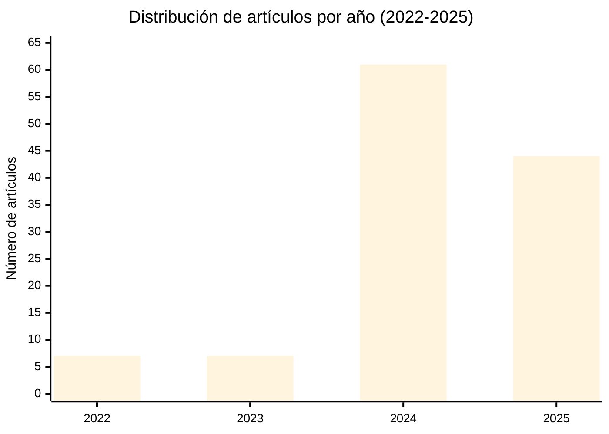

# Estado del arte. La personalidad sintética: evaluación psicológica de modelos de lenguaje (LLMs)

## Descripción

Este repositorio contiene una revisión sistemática de la literatura académica sobre la evaluación psicológica y manifestación de rasgos de personalidad en modelos de lenguaje grandes (LLMs, por sus siglas en inglés). La compilación abarca 119 artículos científicos publicados entre 2022 y 2025, proporcionando un análisis exhaustivo del estado actual de la investigación en este campo emergente.

## Contenido

El documento principal [`state-of-the-art-synthetic-personality-llms.md`](state-of-the-art-synthetic-personality-llms.md) incluye una tabla completa con la siguiente información para cada artículo:

- Número de referencia
- Título en inglés
- Título en español
- Resumen (abstract) en inglés
- Resumen en español
- URL del artículo original
- Idioma de publicación
- Año de publicación
- Autores
- Palabras clave

## Áreas temáticas

La revisión bibliográfica cubre las siguientes áreas de investigación:

### Evaluación psicométrica
- Aplicación de marcos teóricos clásicos (Big Five, MBTI, HEXACO, Myers-Briggs)
- Validación de instrumentos psicométricos para LLMs
- Confiabilidad y estabilidad de mediciones de personalidad
- Desarrollo de nuevas herramientas de evaluación específicas para IA

### Simulación y control de personalidad
- Métodos de inducción de rasgos de personalidad mediante prompts
- Técnicas de entrenamiento para alineación con perfiles específicos
- Consistencia de personalidad en múltiples contextos
- Personalización de agentes conversacionales

### Aplicaciones prácticas
- Agentes virtuales y sistemas de recomendación
- Evaluación psiquiátrica automatizada
- Simulación de comportamiento humano
- Interacción humano-computadora

### Consideraciones metodológicas y críticas
- Limitaciones de tests de autoevaluación en LLMs
- Disociación entre autoreportes y comportamiento
- Sesgos y aspectos éticos
- Validez de constructo en evaluación de IA

## Metodología

La selección de artículos se realizó mediante búsqueda sistemática en las siguientes fuentes:

- ArXiv (preprints)
- ACL Anthology
- Conferencias principales: NeurIPS, EMNLP, ACL, NAACL, EACL, COLING
- Revistas científicas: Nature, PNAS Nexus, JMIR, Computational Linguistics
- Bases de datos: PubMed Central, ResearchGate

Se priorizaron artículos que abordan directamente la evaluación, medición, inducción o manifestación de rasgos de personalidad en modelos de lenguaje grandes, con énfasis en estudios empíricos y marcos metodológicos rigurosos.

## Estadísticas

- Total de artículos: 119
- Rango temporal: 2022-2025
- Idioma de publicación: inglés (100%)
- Artículos con texto completo disponible: 119 (100%)

## Distribución temporal

- 2022: 7 artículos
- 2023: 7 artículos
- 2024: 61 artículos
- 2025: 44 artículos

## Uso y citación

Este recurso está disponible para la comunidad académica. Si utiliza esta compilación en su investigación, se agradece la citación apropiada del repositorio.

## Contribuciones

Este es un proyecto de documentación académica. Para sugerencias de artículos adicionales o correcciones, se aceptan pull requests siguiendo las normas de citación establecidas.

## Licencia

El contenido de este repositorio se proporciona con fines académicos y educativos. Los derechos de autor de los artículos individuales pertenecen a sus respectivos autores y editoriales.

## Contacto

Para consultas o colaboraciones: hola@00b.tech

---

Última actualización: octubre 2025
